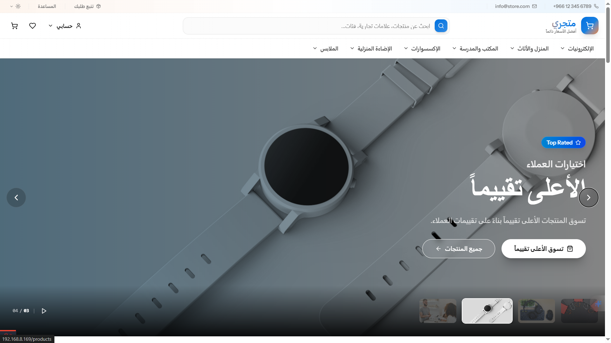
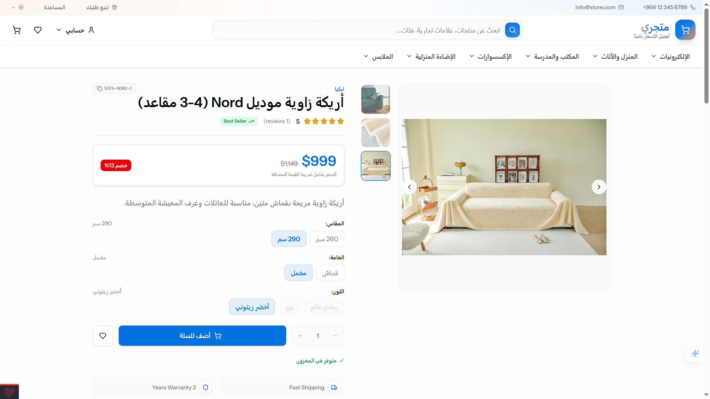
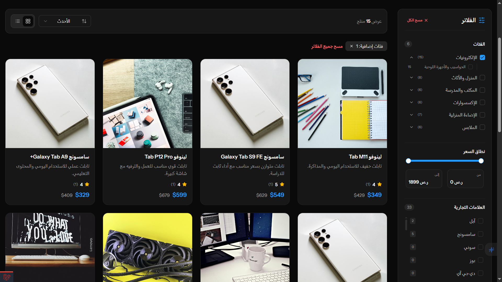
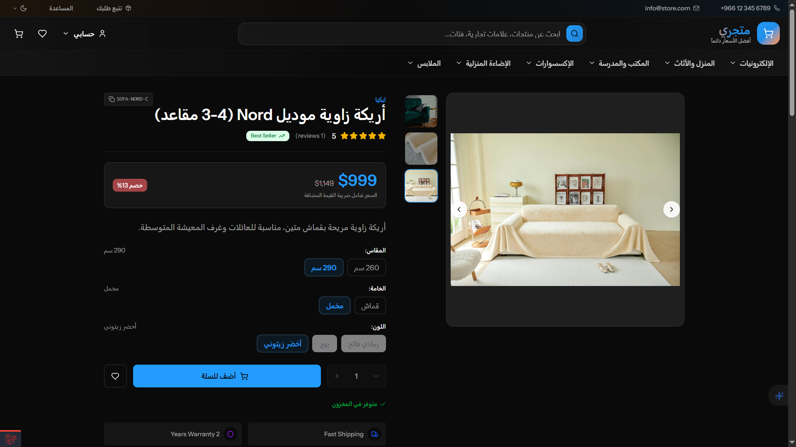
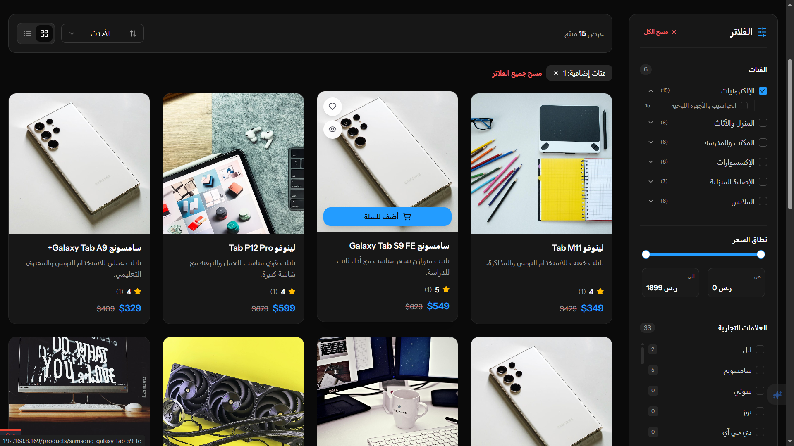
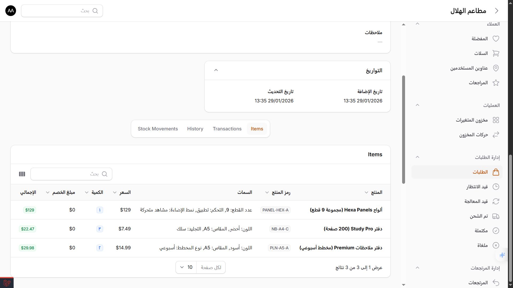
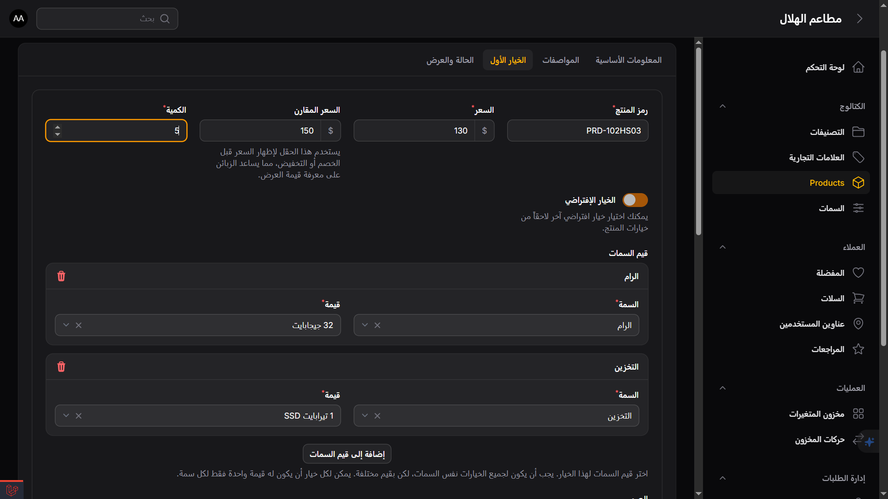
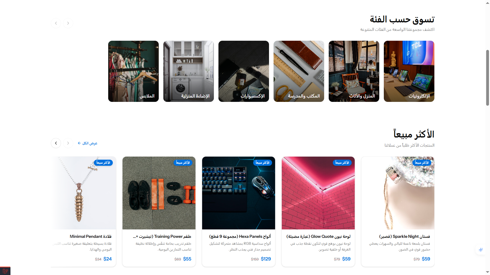

**# Ecommerce Multi Variants

A modern e-commerce platform built with **Laravel 12**, **Inertia.js v2 + React 19**, and a powerful admin experience powered by **Filament v4**. The core focus of this project is professional multi-variant product management, accurate inventory control, a complete order lifecycle, and a practical returns workflow.

> Project status: actively in development. The current architecture is ready to scale, and the next step is to formally add discounts, promotions, and coupons.

## Demo

You can try the live version of the project using the link below:

<p>
  <a href="https://ecommerce-laravel-react-inertia-production.up.railway.app" target="_blank" rel="noopener noreferrer">
    
  </a>
</p>

## Tech Stack

<p align="center">
  
  
  
  
  
  <br />
  
  
  
  
</p>

## Screenshots

<p align="center">
  
  
</p>
<p align="center">
  
  
</p>

<p align="center">
  
  
  
  
  <br />
  
  
  
</p>

## What Makes This Project Stand Out?

- Deep support for multi-variant products (attributes + values + variant generation).
- Precise inventory management built around a Stock Movements ledger.
- A complete order lifecycle: placement, payment, status changes, cancellations, and returns.
- Stripe payments via Hosted Checkout with webhooks and a well-structured financial ledger.
- A professional admin panel via Filament with roles and permissions (RBAC) using Filament Shield.

## Core Technologies

| Area | Technologies |
| --- | --- |
| Backend | PHP 8.4, Laravel 12 |
| Admin Panel | Filament v4, Filament Shield |
| Frontend | Inertia.js v2, React 19, TypeScript, Tailwind CSS v4 |
| Data Layer | Eloquent ORM, Spatie Laravel Data, Spatie Query Builder |
| Payments | Stripe (Checkout + Webhooks) |
| Money | brick/money |
| Local Dev | Laravel Sail |

## Domain Overview

The system is designed as a practical e-commerce platform that can be run in real scenarios or used as a strong foundation for a larger product. The current emphasis is on domain quality and architecture more than surface-level polish.

### Key Capabilities Today

- A strong catalog: hierarchical categories (Nested Set), brands, specifications, and multi-image support.
- A smart variant engine: attribute selection directly controls available values and the final resolved variant.
- A smart cart: supports guests and merges automatically after login.
- A safer checkout: uses idempotency to prevent duplicate order creation.
- Orders and status management: with a full historical trail for every status change.
- Realistic returns (RMA): approval, receiving, inspection, resolution (refund/replacement/reject), and financial settlement.
- Auditable inventory: every change is stored as an independent movement with before/after quantities.
- Fast search suggestions (autocomplete) with smarter ranking and short-lived caching.

## Key Database Tables

### Catalog and Products

| Table | Purpose |
| --- | --- |
| `categories` | Hierarchical categories using `_lft` and `_rgt` |
| `brands` | Brands |
| `products` | The main product record and its statistics |
| `product_variants` | Variants (SKU, price, quantity, compare_at_price) |
| `attributes` | Attribute definitions (e.g., color, size) |
| `attribute_values` | Attribute values |
| `attribute_value_product_variant` | Variant-to-attribute-value mapping with strict integrity rules |
| `images` | Polymorphic multi-image support |

### Customers and Engagement

| Table | Purpose |
| --- | --- |
| `users` | Users with admin and activation flags |
| `user_addresses` | Shipping addresses with a default option |
| `reviews` | Product reviews |
| `wishlists` | Wishlist items at the variant level |
| `stock_notifications` | Back-in-stock subscriptions |

### Cart and Orders

| Table | Purpose |
| --- | --- |
| `carts` | A cart for a user or a guest via `session_id` |
| `cart_items` | Cart items with per-item selection state |
| `orders` | Order header with shipping snapshot and totals |
| `order_items` | Order lines with a full variant snapshot at purchase time |
| `order_histories` | Order status history (critical for transparency and auditability) |

### Returns, Inventory, and Payments

| Table | Purpose |
| --- | --- |
| `returns` | Return header (RMA) linked to the original order |
| `return_items` | Return line items |
| `return_item_inspections` | Inspection outcomes by condition/resolution |
| `return_histories` | Return status history |
| `stock_movements` | Inventory movement ledger with before/after and source references |
| `transactions` | Financial ledger (payments/refunds) with gateway references |

## High-Level Flows

### 1) Variant Selection

- The system aggregates attributes from all variants.
- Each selection narrows the pool of valid variants.
- Invalid values are automatically disabled.
- The final variant is resolved consistently, even with partial or conflicting input.

### 2) Checkout and Payment

- Totals are calculated via `PricingService`.
- The order and stock deductions are created inside a single transaction in `OrderCheckoutService`.
- Payment is handled via Stripe Hosted Checkout.
- The webhook is treated as the final source of truth for payment status.

### 3) Cancellations and Returns

- Cancellation restocks inventory only when a sale movement exists and a cancellation movement has not already been recorded.
- Returns support approval, receiving, inspection, and a final decision (refund/replacement/reject).
- Financial settlements are recorded clearly inside the `transactions` ledger.

## Admin Panel

The admin panel runs via Filament at the following path:

```text
/admin
```

It covers a wide range of operational needs:

- Catalog management: categories, brands, attributes, products, and variants.
- Inventory management: stock movements and variant availability levels.
- Order management: statuses, cancellations, payments, and refunds.
- Returns management: the full return lifecycle including inspections and resolutions.
- Customer management: users, addresses, carts, and wishlists.
- Roles and permissions via Filament Shield.

## Production Runtime

In production, we rely on:

- **Laravel Octane** with **FrankenPHP** for improved performance.
- **Supervisor** to run and manage processes.
- Pre-warming caches and assets before the server starts.

You can review this directly in the following files:

- `Dockerfile`
- `.docker/supervisord.conf`
- `.docker/entrypoint.sh`

## Quick Start (Local Development)

### Requirements

- PHP 8.4+
- Composer
- Node.js 20+
- A database (SQLite for quick trials or MySQL for production-like setups)

### Fastest Setup

```bash
composer run setup
composer run dev
```

### Manual Setup (Short Version)

```bash
cp .env.example .env
php artisan key:generate

# Quick SQLite setup
php -r "file_exists('database/database.sqlite') || touch('database/database.sqlite');"
php artisan migrate --seed

npm install
npm run dev
php artisan serve
```

## Default Admin Account (For Demo)

Seeded via `DatabaseSeeder` if no admin user exists yet:

- Email: `admin@gmail.com`
- Password: `12345678`

> It is strongly recommended to change these credentials in any real environment.

## Important Environment Variables

Key variables related to the system runtime:

```dotenv
APP_URL=http://localhost:8000

DB_CONNECTION=sqlite
DB_DATABASE=database/database.sqlite

PAYMENT_GATEWAY=stripe
PAYMENT_CURRENCY=USD

STRIPE_KEY=
STRIPE_SECRET=
STRIPE_WEBHOOK_SECRET=
```

## Engineering Notes

- Inventory is modeled as a movement ledger, which provides high auditability.
- Variant resolution is handled at the domain level, not just in the UI.
- Payments are designed with idempotency and webhooks to reduce gray areas.
- The architecture is ready to introduce discounts and promotions without breaking the core.

## Near-Term Roadmap

In the next phase, we plan to add:

- A Discounts & Promotions engine.
- Coupons with flexible eligibility rules.
- Deeper improvements to search and recommendations.
- Expanded analytics and business metrics.

## License

This project is open source under the MIT license. See `LICENSE`.
**